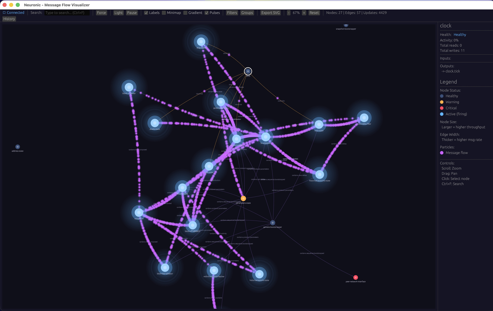
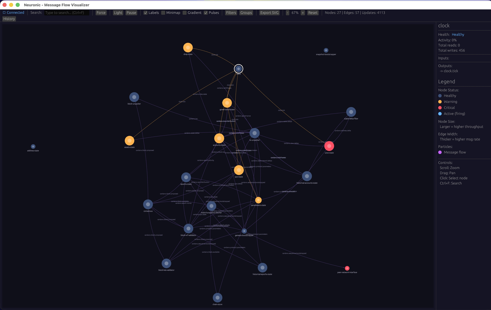

# Neuronic

Real-time graph visualization for message bus systems.



## Background

Neuronic was developed for [Acropolis](https://github.com/input-output-hk/acropolis), a modular Rust implementation of a Cardano node. Acropolis uses the [Caryatid](https://github.com/input-output-hk/caryatid) framework, which provides an event-driven architecture where modules communicate over a message bus (RabbitMQ or an in-memory bus for single-process deployments).

Caryatid includes a monitoring layer that wraps the message bus and tracks per-module, per-topic metrics: message counts, backlog depths, and pending durations. These snapshots are published periodically to a configurable topic (default: `caryatid.monitor.snapshot`).

[buswatch](https://github.com/lowhung/buswatch) provides a TUI for this data. Neuronic provides a GUI with force-directed graph layout, making it easier to understand topology and spot bottlenecks visually.

Both tools depend on `buswatch-types` for snapshot deserialization. The architecture is not Cardano-specific - any system publishing compatible monitoring snapshots can use these tools.

## Overview

Neuronic subscribes to a monitoring topic and renders module connectivity as an interactive graph:

- **Nodes** represent modules/services
- **Edges** represent topics connecting producers to consumers
- **Colors** indicate health status based on configurable thresholds



## Features

- **Live updates** - graph redraws as snapshots arrive
- **Force-directed layout** - physics-based node positioning with repulsion/attraction forces
- **Curved Bezier edges** - quadratic curves for clear edge tracing
- **Node dragging** - manual repositioning when needed
- **Light/dark themes**
- **Fuzzy search** (Ctrl+F)
- **Configurable health thresholds** - warning/critical states based on backlog depth or pending time

Visual indicators:
- Particles flow along edges during active message traffic
- Pulse rings expand from nodes under heavy load
- Node intensity scales with throughput

## Installation

```bash
cargo install --path .
neuronic
```

With options:

```bash
neuronic --config neuronic.toml --debug
```

## Configuration

Neuronic loads configuration from multiple sources (in order of priority):

1. `config.default.toml` - Default settings (shipped with the project)
2. `neuronic.toml` - User overrides (or custom path via `--config`)
3. Environment variables with `NEURONIC_` prefix

Copy `config.default.toml` to `neuronic.toml` and customize as needed:

```toml
# RabbitMQ connection (Option 1: simple format)
[rabbitmq]
url = "amqp://127.0.0.1:5672/%2f"
exchange = "caryatid"

# RabbitMQ connection (Option 2: Caryatid-style format)
# [message-bus.external]
# class = "rabbit-mq"
# url = "amqp://127.0.0.1:5672/%2f"
# exchange = "caryatid"

# Topic filtering - hide noisy topics
[filter]
ignored_topics = ["cardano.query."]

# Health thresholds
[graph]
backlog_warning = 100      # Messages before warning state
backlog_critical = 1000    # Messages before critical state
pending_warning_ms = 500   # Milliseconds before warning
pending_critical_ms = 2000 # Milliseconds before critical
```

Environment variables are also supported with the `NEURONIC_` prefix (e.g., `NEURONIC_GRAPH_BACKLOG_WARNING=50`).

## Layout modes

- **Force-directed** (default) - nodes repel, edges attract. Organic clustering.
- **Hierarchical** - sources at top, sinks at bottom. Useful for understanding dataflow direction.

## Library Usage

Neuronic can also be used as a library to embed visualization in your own application:

```rust
use neuronic::{MessageFlowGraph, HealthConfig, NeuronicConfig};

// Create a graph with custom thresholds
let graph = MessageFlowGraph::new_with_config(
    HealthConfig::default(),
    vec!["noisy.topic.".to_string()],
);

// Update from buswatch snapshots
graph.update_from_snapshot(&snapshot);
```

See the [API documentation](https://docs.rs/neuronic) for full details.

## Project structure

```
src/
├── lib.rs            # Library entry point
├── main.rs           # CLI entry point
├── config.rs         # Configuration loading
├── subscriber.rs     # RabbitMQ subscriber
├── graph.rs          # Graph model (petgraph)
└── ui/
    ├── mod.rs        # UI module exports
    ├── app.rs        # eframe application
    ├── theme.rs      # Color schemes
    ├── drawing.rs    # Bezier edge rendering
    ├── input.rs      # Mouse/keyboard handling
    ├── layout.rs     # Force-directed simulation
    ├── animations.rs # Particle and pulse effects
    ├── panels.rs     # Side panels
    ├── search.rs     # Fuzzy search
    ├── export.rs     # SVG export
    └── types.rs      # Shared types
```

## Dependencies

- [eframe/egui](https://github.com/emilk/egui) - Cross-platform GUI
- [petgraph](https://docs.rs/petgraph) - Graph data structure
- [lapin](https://docs.rs/lapin) - RabbitMQ AMQP client
- [buswatch-types](https://github.com/lowhung/buswatch) - Snapshot format

## Related

- [buswatch](https://github.com/lowhung/buswatch) - TUI for the same monitoring data
- [Caryatid](https://github.com/input-output-hk/caryatid) - The underlying modular framework
- [Acropolis](https://github.com/input-output-hk/acropolis) - Cardano node implementation using Caryatid

## License

Apache-2.0
